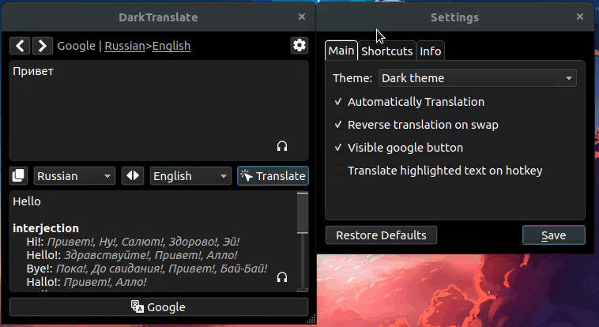
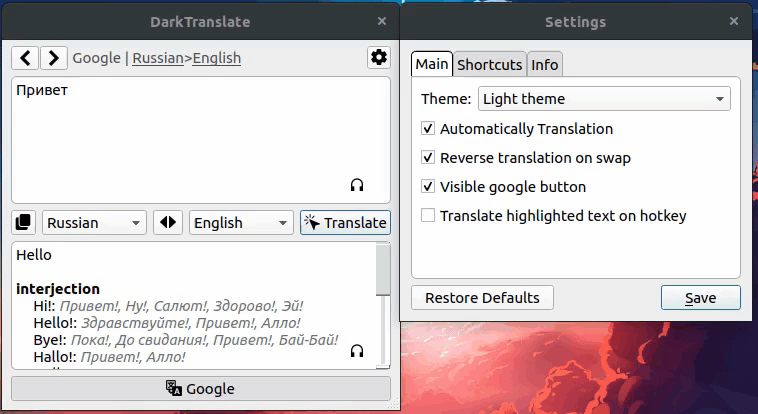

# Dark Translate

Desktop translator written in Python using PyQt5.

## Appearance
#### Dark theme:

#### Light theme:

## Features
* Translate from any language with autodetection
* Auto translation when typing
* Cache with recently translated phrases
* 2 different themes
* Changeable shortcuts
* Global hotkey to translate highligted text (or copied to the clipboard)
* Pronounce text (_temporarily out of service_)

## Download/Install

_*In the process.*_
